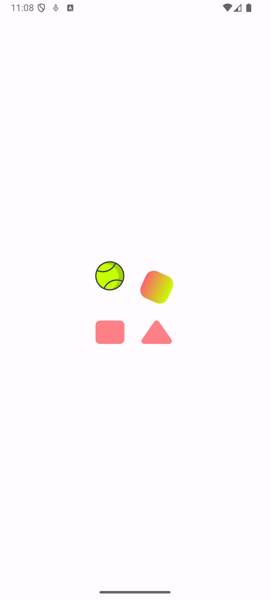
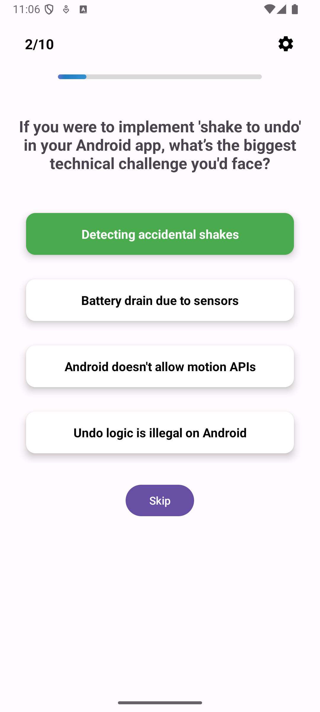
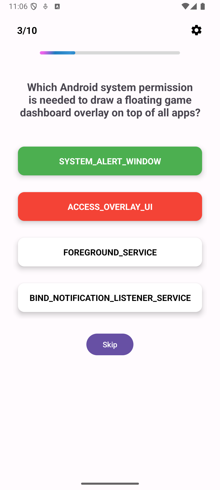
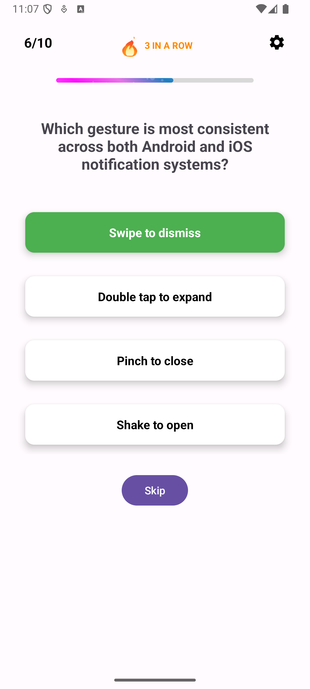
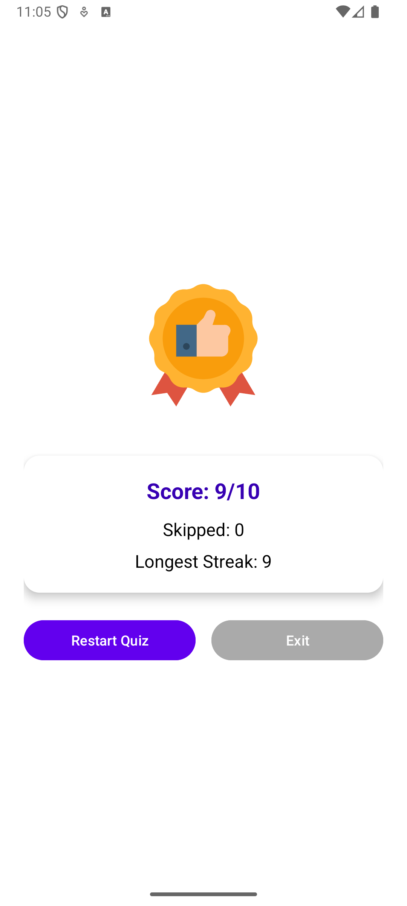
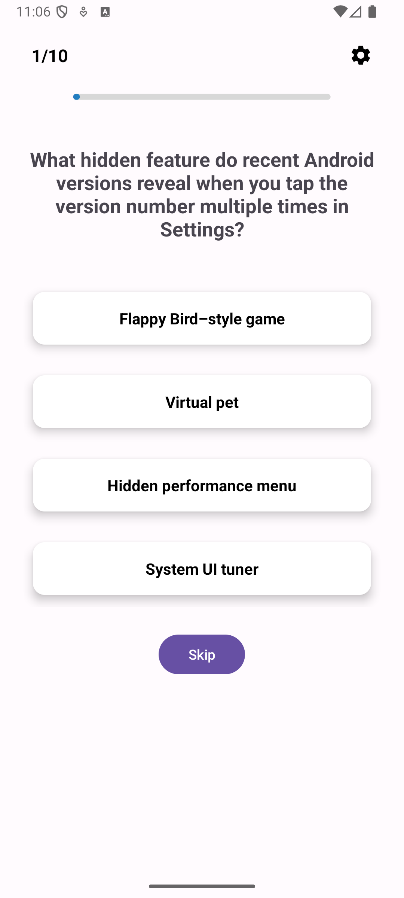

# Quizzy 📚

A modern Android quiz application built with Kotlin, featuring an engaging user interface with animations and real-time feedback.

## 🎯 Features

- **Interactive Quiz Experience**: Multiple-choice questions with smooth animations
- **Progress Tracking**: Visual progress bar showing quiz completion
- **Streak System**: Tracks consecutive correct answers with fire animations
- **Real-time Feedback**: Immediate visual feedback for correct/incorrect answers
- **Modern UI**: Material Design 3 with beautiful animations and transitions
- **Network Integration**: Fetches quiz questions from external API
- **Responsive Design**: Optimized for different screen sizes and orientations

## 🏗️ Architecture

This project follows modern Android development best practices:

- **MVVM Architecture**: Clean separation of concerns with ViewModels
- **Dependency Injection**: Hilt for dependency management
- **Navigation Component**: Type-safe navigation between fragments
- **Retrofit**: Network calls for fetching quiz data
- **Coroutines**: Asynchronous programming for smooth UI
- **ViewBinding**: Type-safe view access

### Project Structure

```
app/src/main/java/com/project/quizzy/
├── data/
│   ├── model/
│   │   └── Question.kt          # Data model for quiz questions
│   └── repo/
│       └── QuizRepository.kt     # Repository pattern implementation
├── di/
│   └── AppModule.kt             # Hilt dependency injection module
├── network/
│   ├── QuizApiService.kt        # Retrofit API interface
│   └── RetroFitInstance.kt      # Retrofit configuration
├── ui/
│   ├── MainActivity.kt          # Main activity
│   ├── quiz/
│   │   └── QuizFragment.kt      # Quiz gameplay screen
│   ├── result/
│   │   └── ResultFragment.kt    # Results screen
│   ├── splash/
│   │   └── SplashFragment.kt    # Splash screen
│   └── QuizApp.kt               # Application class
└── viewmodel/
    ├── QuizUiState.kt           # UI state management
    └── QuizViewModel.kt         # Quiz business logic
```

## 🛠️ Technologies Used

- **Kotlin**: Primary programming language
- **Android Jetpack Components**:
  - Navigation Component
  - ViewModel
  - LiveData
  - ViewBinding
- **Dependency Injection**: Hilt
- **Networking**: Retrofit + Gson
- **UI/UX**: Material Design 3, Lottie animations
- **Architecture**: MVVM pattern
- **Build System**: Gradle with Kotlin DSL

## 📱 Screenshots









